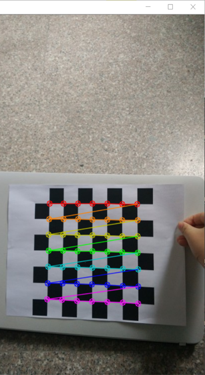
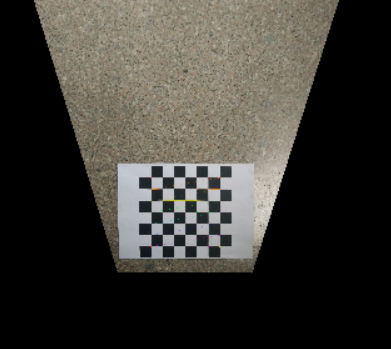

#brid-eye 
The camera calibration problem is a primer in the field of machine vision.I used a chessboard calibration method which is wildly used in this field  for it's conveniency since Chinese computer scientist Zhang Youzheng had put it forwards.
This method is based on taking some photos for a certain target boards in different direction (more than three times) .Without knowing the movement of the calibration plate,We can get a direct access to the inside cowfficient and  distortion coefficient of camera. The calibration accuracy is higher than the traditional  calibration method, and does not require high precision positioning device. Is this case i take a lot of picture of chessboard for the calculation of camera coefficient.I uploaded all of them .Then i use opencv tool to translate into it's bird-eye view.

